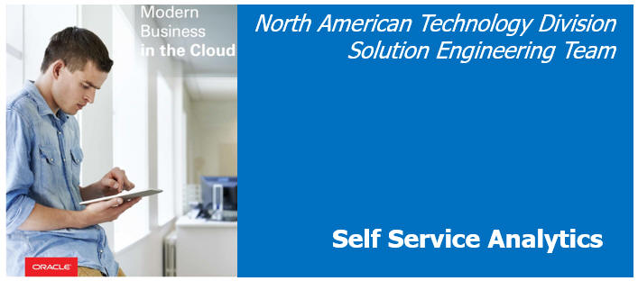

  

Updated: Auggust 13, 2017 for BDCS-CE Version 17.3-3-20

    

# Introduction

In this workshop, you learn how to provision a **Oracle Big Data Cloud Service - Compute Edition (BDCS-CE)** instance and then configure it for use with data science tools like R.  

# How this workshop is organized

The Data Science Acceleration journey workshop builds upon the New Data Lake journey.

As such, this workshop will re-use parts of the New Data Lake journey.  Specifically, it will re-use Lab100 and Lab200 from the New Data Lake journey.

Please 

+ Navigate to the New Data Lake journey at [https://oracle.github.io/learning-library/workshops/journey2-new-data-lake/](https://oracle.github.io/learning-library/workshops/journey2-new-data-lake/) 
+ Complete New Data Lake Lab 100 "Start Here - Provisioning"
+ Complete New Data Lake Lab 200 "Getting to know BDCS-CE"

before returning to the Data Science Acceleration journey.

# Next Steps

Once you have completed Lab 100 and Lab 200 from the New Data Lake Journey, you can proceed to Data Science Acceleration Lab 200 to learn how to configure R with BDCS-CE.

# Want to Learn More?

- [R project](https://www.r-project.org/)

- [SparkR (R on Spark)](http://spark.apache.org/docs/latest/sparkr.html)

