# Demo Introduction

 -- This lab (Big Data Preparation Cloud Service) is under construction and a new version is in the works.  The instructions currently listed below may be **inaccurate** or **incomplete**.


## Keywords:

```
Oracle Big Data Cloud Service, Oracle Storage Cloud Service, Oracle Database Cloud Service
```
## Goal of Demo:

Oracle Big Data Preparation Cloud Services can ingest data from various sources, do transformation then
publish to selectable targets.

This demo will show how to define sources which include input from Object Store in Oracle Storage Cloud
Service and output to an Oracle Database instance in Oracle Database Cloud Service.

This demo also demonstrates how to customize a transformation workflow to prepare, clean and enrich
the data by leveraging a built-in automated tool where very little coding is necessary.

## Pre-requisites:

```
Users must have subscribed for required Oracle Cloud Services.
Resources have been configured in both Oracle Storage Cloud and Oracle Database Cloud.
```
# Demo Steps

## Step 1: Login into Oracle Big Data Preparation Cloud Service

Open a browser and input the URL of your Oracle Big Data Preparation Cloud Service. If you did not login
yet, following page will display to request a user authentication.

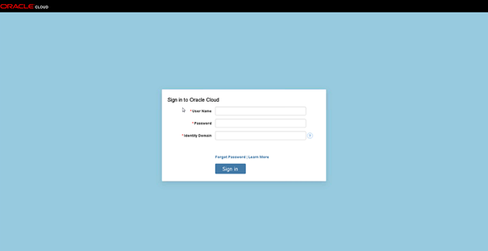 

After a successful login, you will see home page of the Big Data Preparation Service as below.
In the home page, UI gadgets are grouped in several panels. The **Overview** panel displays monitoring and
statistics information of the Preparation Service. The **Quick Start** panel provides instant access to mostly used
functions of Preparation Service. The **Resources** panel has links to useful resources to get help of Preparation
Service. The **Active Stream** panel lists recent tasks ordered by their execution time.

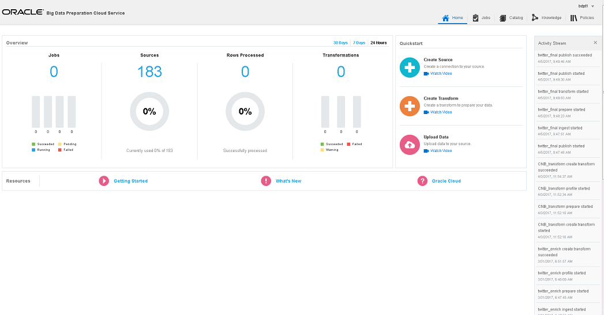 

## Step 2: Create Sources

In this step, we will create Sources that are to be used as either input or output of Transforms in this demo.
The instant way is to access **Create Source** function in the **Quick Start** panel. Following dialog will be launched to define a new Source.

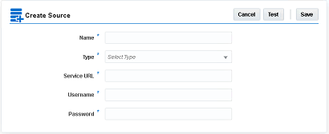 

```
General steps to define a Source:
```
1. Give a valid name of the Source.

2. Choose type of the Source from drop-down list. Current valid source types include:

    **Type | Description**
    |----------|:-------------:|
    Oracle Cloud Storage | Oracle Storage Cloud Service
    Oracle BICS    | Oracle Business Intelligent Cloud Service
    Oracle DVCS | Oracle Data Visualization Cloud Service
    BDP HDFS | Local Hadoop HDFS
    Oracle DBCS | Oracle Database Cloud Service

Required fields for each source type are varied. Those fields can be displayed dynamically in the dialog after a type is selected.

3. After all required fields are specified, click **Test** button in the dialog to test the connection.

4. If test passed, click **Save** button to save the Source in the Preparation Service.

**2.1 Create a Source that points to the Oracle Storage Cloud Service**

In this demo, Oracle Storage Cloud is used for both input and output of Transforms.
Required parameters for this type of Source include Service URL , Username and Password. Because the
parameters are same as the original dialog, there will not be any change in the dialog UI after selecting **Oracle
Cloud Storage** in the **Type** field.

Values for those parameters can be known from configuration of the Oracle Storage Cloud Service. In the
following Overview page of Oracle Storage Cloud Service, REST Endpoint is the source of Service URL parameter.
Username and password parameters are identical as those used to login the Oracle Storage Cloud Service.

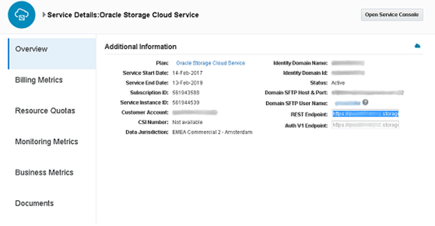 

**2. 2 Create a Source that points to a DB instance in Oracle Database Cloud Service**

In the demo, a DB instance in the Oracle Database Cloud Service is the output of Transform.
Required parameters for such kind of resource include JDBC Connection, Username, Password and Driver.
After selecting **Oracle DBCS** in the **Type** field, the dialog UI is changed dynamically to display those required
parameters.

 

**JDBC Connection** parameter is the URL that pointing to an Oracle DB instance in Oracle DB Cloud Service.
The format of the URL is well-known as _jdbc:oracle:thin:@<host>:<port>:<instance name>._

```
Username/Password parameters are credential information to authenticate the Oracle DB instance.
Driver parameter currently is a fixed value and will be assigned automatically.
```
## Step 3 : Customize Data Preparation Process

In this step, we will demonstrate how to customize a data preparation process in Oracle Big Data
Preparation Service.

Transform is core to implement data preparation logic. It enables loading data from an input Source, then
doing any transformation, finally publishing transformed result to an output Source.

**3. 1 Create a Transform**

**Quick Start** panel in Preparation Service home page has an instant link to create a Transform. User can
also find a **Create Transform** button in the **Catalog** tab shown below.

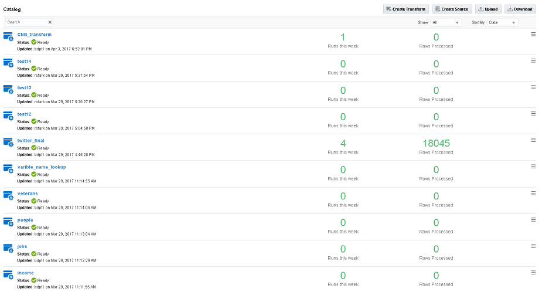 
```
No matter which way, following dialog will appear let user to create a new Transform.

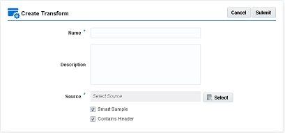

```
Give a valid name of the Transform and optionally describe the Transform with a few simple words. Click
**Select** button next to the Source field to launch following dialog.


In the dialog, user can select data object in a Source as input of the Transform. All Sources that you have
created can be selected from the drop-down list. Sources in the list are organized by the type and name.

After selecting a Source, all data objects in the Source are retrieved and displayed in the list below the
Source field.

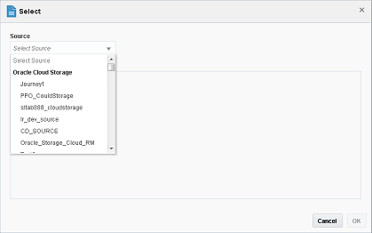

In this demo, select the Oracle Storage Cloud Source you just created.

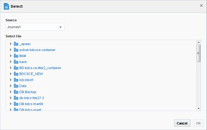

For Oracle Storage Cloud Source, data objects are organized in the hierarchy of _Container -> Object_. User
can choose a Container, which means all data objects in the Container will be selected as input. User can also
choose an individual data object in a Container, which means only this data object will be input of the Transform.

In this demo, we will use a data file in Oracle Storage Cloud. After selecting the data file, click **OK** button
in the dialog to return to previous dialog. Name of the Source is displayed in the Source field, and name of the
data object is displayed just below the Source field.

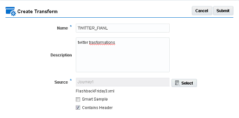

There are two additional checkboxes in the dialog to control how to use data from the Source.
 **Smart Sample**
It enables picking only subset from huge amount of data. If need to process all data in the data object,
then uncheck this option.
 **Contains Header**
Some data format may include headers to describe name of each column. Disable this option will suppress
those headers in the transformation process.
Uncheck **Smart Sample** because we need to process all data in the data file, then click **Submit** button.
The Transform is created and displayed in the catalog list. A task is launched immediately to detect format
of the data object and then load data for analyzing. It normally will take a while to complete. You can notice a
blue bar in the page indicating progress of the task. Before the task completes, state of the Transform is **In
Progress**. Detailed steps of the task are displayed in the **Active Stream** panel. After the task completes
successfully, the Transform will switch to **Ready** state.

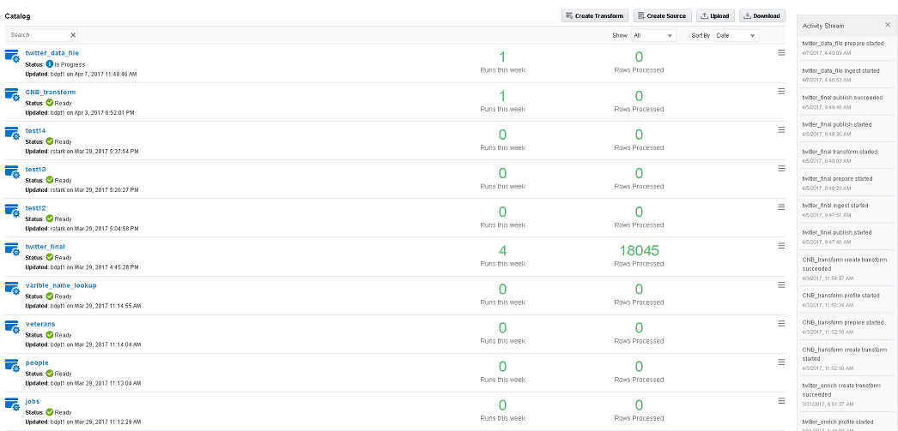

**3. 2 Customize Transform Workflow**

After a Transform is created, data is loaded into memory as a dataset. Preparation Service can do broad
range of transformation to the dataset with built-in tasks. Transformation tasks are executed sequentially on a
dataset as a workflow.


Clicking a Transform in the catalog list will launch a new page to customize the workflow.
In the middle of the page, a panel lists available columns in the dataset. State, name, type and sample
value of a column are displayed in a single row. Built-in transformation tasks can be launched by actions in a
toolbar on top of the panel and a pop up menu triggered from a button in each row.

In the right of the page, a panel is used to show profile of data in the dataset. If no column is selected,
profile of whole dataset is displayed. When a column is selected, it will show profile of the column.

In the left-top of the page, all generated transformation tasks in the workflow are listed in the **Workflow
Script** panel.

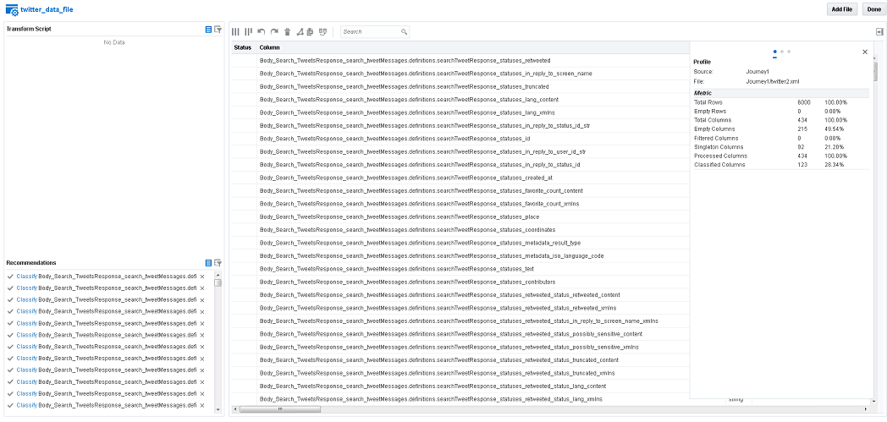 

After reviewing sample values of columns in the dataset, it is apparently that lots of columns are empty
without any value. Most of those empty columns are meaningless but still need to spend time on processing if
kept in the dataset. So the first transformation task in the demo is to remove those empty columns from the
dataset. You do not need to identify empty columns in a dataset by yourself. Data Preparation Layer can do it
automatically.

To remove empty columns, click  action in the toolbar. A dialog as below will pop up to let users to
choose empty columns to remove.

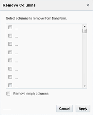

You can select individual columns in the list or all columns in the list by checking **Remove empty columns**
box below. After making your decision, click **Apply** button in the dialog.

After returning to the design page, you can check that those empty columns you selected are removed
from the dataset. Also you may notice that a transformation task is listed in the **Workflow Script** panel.

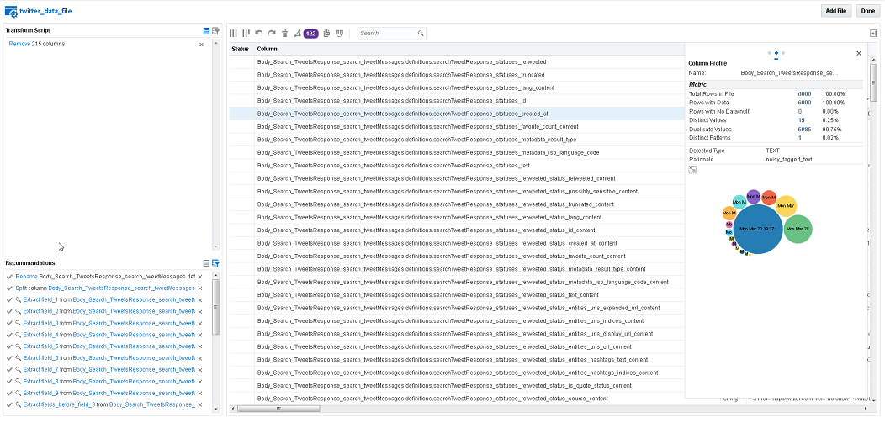

Remaining transformation tasks in the demo are based on individual column in the dataset. By clicking
button in the right of a column name, following menu will pop up. From the menu you can choose any
transformation task.

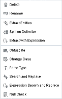

In the demo, original data file is in XML format. Default name of a column is generated automatically based
on the hierarchy of the XML element. However those names are not user-friendly.

To assign a user-friendly name to a column, select **Rename** in the menu. Following dialog will prompt to
allow users give a new name to the column.

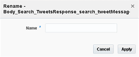

After assigning a new name, click **Apply** button to generate a task to change name of the column. Name
of a column must be unique in a dataset.


```
If the task is successfully executed, name of the column is changed in the design page. A blue check icon  is displayed as state of the column to indicate that some corrections have been applied to the column.

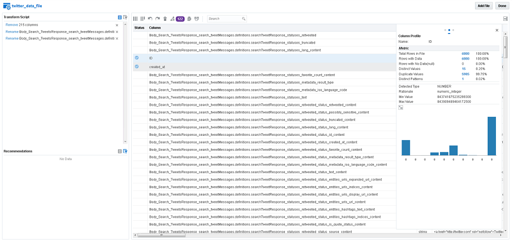

```
In the demo, a single location column in the original dataset is used to indicate where a Twitter user’s
home is. However, we need two columns, City and Country, in the target database for better analysis in the
future.

After reviewing sample values of the location column, there are six possible formats: “ _City, Country_ ”, “ _City,
State_ ”, “ _City, State, Country_ ”, “ _City_ ”, “ _Country_ ” and “ _State, <Descriptive Words>_ ”. We apply following
transformation process to extract usable data from raw values.

First, we will append “N/A” as city to last two types of location values, so that all values can be normalized
to first three formats. To define the transformation, select **Search and Replace** from the pop up menu of the
Location field. Following dialog will appear to allow users to define rules to replace original values. A
replacement rule is defined as an original value and a new value. When the rule is applied, all values that match
the original value will be replaced by the new value. A replacement rule is displayed as a row in the dialog.
Multiple rules can be defined through the dialog.

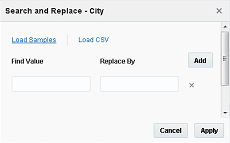

In the dialog, there are three means to define new rules.
The first is by clicking **Load Samples** link. All sample values of the column are populated into **Find Value**
field but leave the **Replace By** field empty. Number of rows (rules) equals to the sample values count. Users
can easily find which value needs to be replaced and specify a new value in the **Replace By** field.

The second is by clicking **Load CSV** link in the dialog. It allows loading replacement rules from an external
file. The file must be in CSV format and with only two columns. The first column is original value and the second
is new value.


The third is defining rules manually. Users need to input both the original value and new value of a rule.
By clicking **Add** button, users can define more rules.

If a rule will not be used any more, for example an original value is not need to be replaced, user can click
button in that row to delete the rule.
In this demo, we will use first means to load sample values. For original values in first three formats, simply
remove those loaded rules. For original values in last two formats, add “NA,” to the leading position.

Next transformation tasks will split the single Location column into separate **City** and **Country** columns.
Choose **Split on Delimiter** from the menu, following dialog will appear.

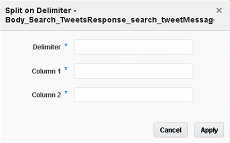 

The transformation will split values of a column into two columns by the delimiter. The part before first
occurrence of the delimiter will be assigned to first column. The part after first occurrence of the delimiter will
be assigned to second column. After clicking **Apply** button in the dialog, a transformation task is launched at
background to create two additional columns into the dataset. After the task completes successfully, the new
columns are displayed in the list. An icon in front of each column indicates that it is created with a
transformation task.

In the demo, the delimiter is comma for the Location column. **City** and **Country** are the name for two columns respectively.

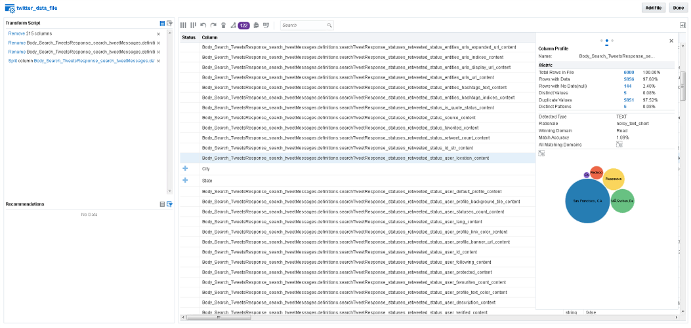 

Now we have initial values for **City** and **Country** columns. However some cleaning action must be taken to
both columns.

**City** column contains meaningless **N/A** value in previous transformation. It needs to be replaced with an
empty value. Launch the **Search and Replace** dialog for the **City** column. Because only a single value needs to
be replaced, we can simply define a single rule manually. Input **N/A** in the first column, and leave the second column empty.

 


After clicking **Apply** button in the dialog, the replacement rules are applied to the **City** column. When task
is done, column state is changed to , which indicates that some corrections have been applied to the column.

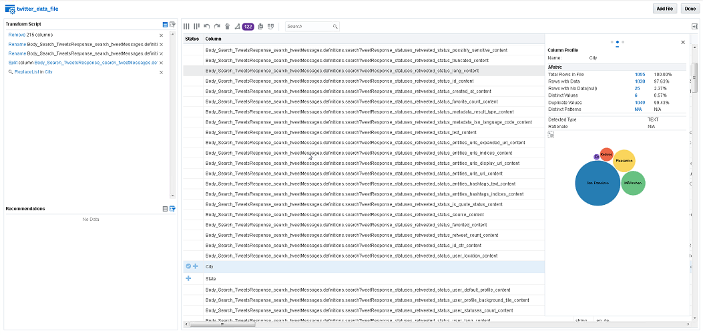 

Values in **Country** column are mixed with state and country. We need to map all those information to a
valid country. Launch Search and Replace dialog for the **Country** column, load initial rules from sample values.

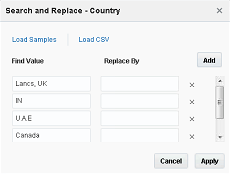 

For any value that reflects a correct country, simply remove the rule. For any value that is not a valid
country, check information carefully and assign a correct country value.

After all transformation tasks have been done, click **Done** button on top of the Workflow Design Page to
go back to Catalog page.

```
N/A
```

**3. 3 Publish Data to Database**

Next step in this demo is to publish data to an Oracle Database. To publish a catalog with a defined data
transformation workflow, just click   button in the right of a catalog. A menu will pop up, and then you can select **Publish** action from the menu.

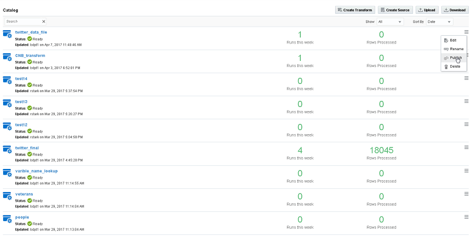 

Following dialog will appear to let you choose which target you want to publish the data.

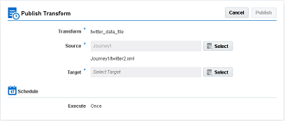 

Click Select button next to the Target field to launch another dialog to select an Oracle Database source.

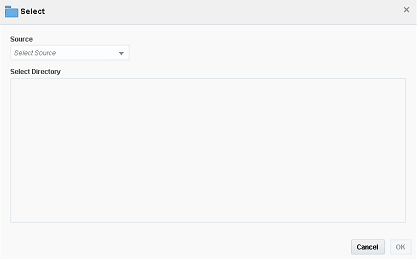 

Choose the database source we created previously from the drop-down list. Because there is no directory
concept in Oracle Database, no object will can be selected from the directory list. Click **OK** button to accept
your choice and go back to previous dialog.

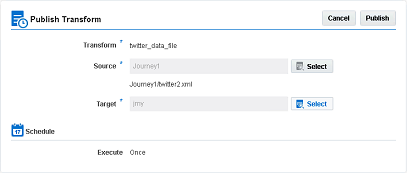 

Both Source and Target are selected for creating a publish job. In the dialog you may notice a **Schedule**
section displayed at bottom, however it only give an indication that the publish job will only “Execute Once”.
We will introduce later how to schedule a publish job by defining Policies. Click the **Publish** button to close the
dialog.

A publish job will be created and launched automatically. You can check state of the job by clicking **Job** tab
on top of the Oracle Big Data Preparation Service page. A job can be found in the job page. If it is not completed,
the state should be **Started**.

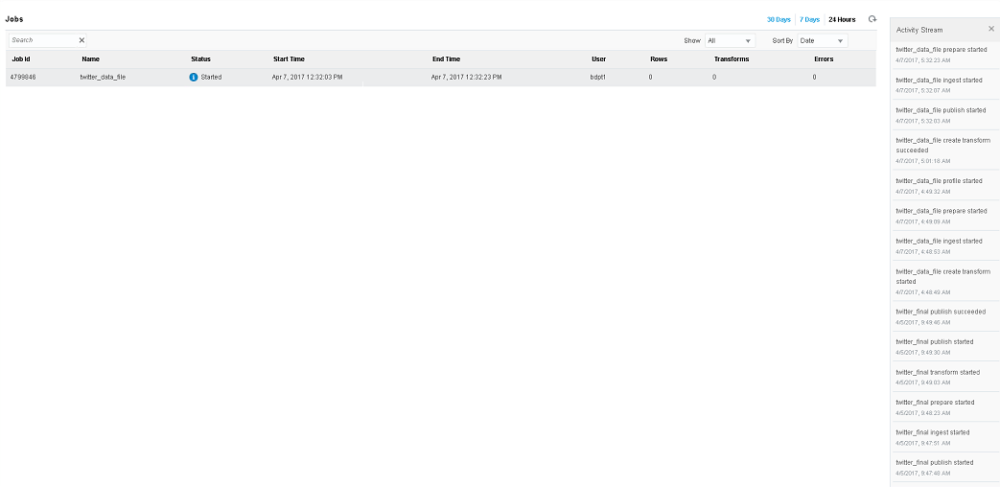 

To monitor the job execution, you can click the job to jump to following **Job Details** page. In the page, lots
of details about the job can be known. From general information of the job to various metrics collected. Step
by step job execution can also be monitored from the **Active Stream** panel.

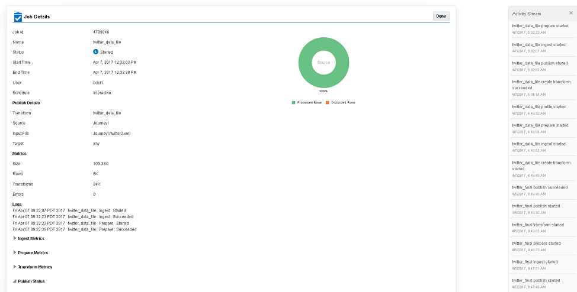 

You can also monitor from the home page. The **Overview** section will show you the information which
includes currently running jobs and rows and transforms processed.

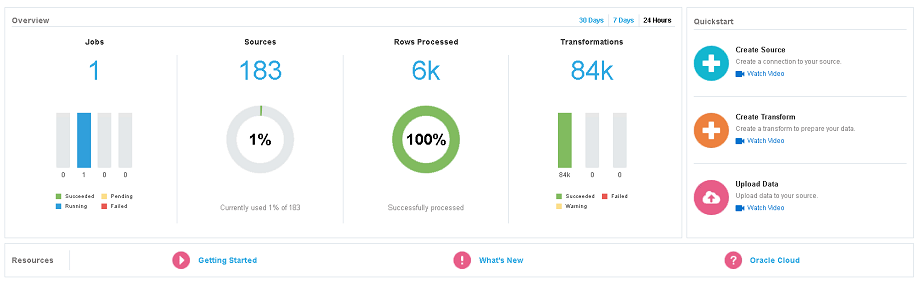 

The job is running at background. When it is done, a light-green banner as below will pop up at top of the
page. During that period, you can do any management task with the tool.

 

After the job completes, you can go again to the **Job Detail** page. General information about the job is
refreshed.

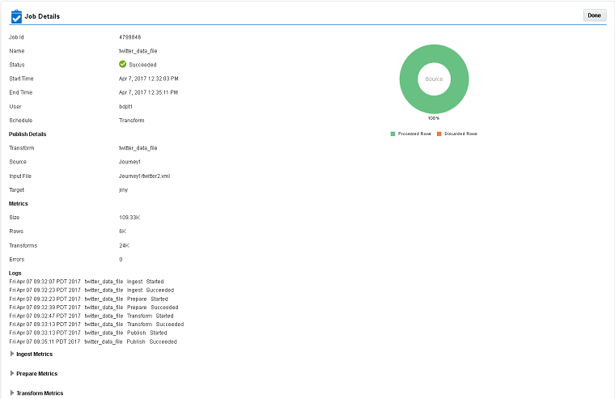 

A lot more metrics can also be seen from the page. By collapsing each metrics section, detailed monitoring
information is displayed in JSON format.

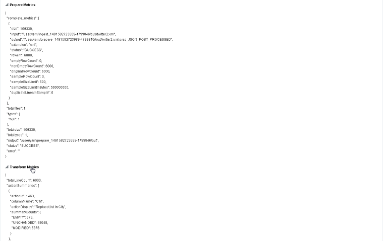 

DDL SQL to create the table is recorded in the page. You can retrieve published data from the Oracle
Database with any tool that you are familiar with, such as SQL * Plus or SQL Developer.


**3. 4 Define a policy to schedule publish jobs periodically**

A transformation workflow on a Catalog can be reused to schedule jobs to capture and publish data
periodically. The job scheduling is defined as a policy in Oracle Big Data Preparation Service.

Go to **Policies** tab on top will switch to following page. In the page, you can manage policies that control
execution of jobs.

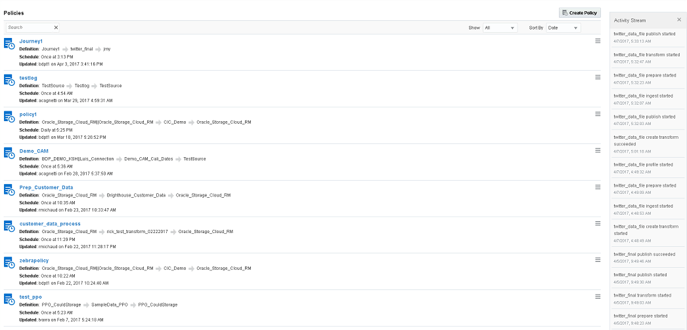 

By clicking **Create Policy** button on top of the page, following dialog will appear to let you define a new
policy.

In general information section, you can select transformation workflow on a catalog or source and also
the target to publish the data. By toggling the checkbox at bottom, users can control whether to publish data
to a new table or refresh data in an existing table.

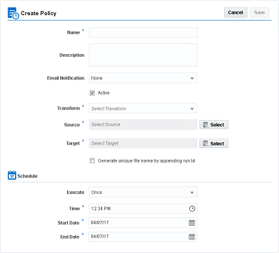 

In the **Schedule** section, you can define when a job will be scheduled. For example: execute once a day at
specific time. The effective period of the policy also need to be specified.

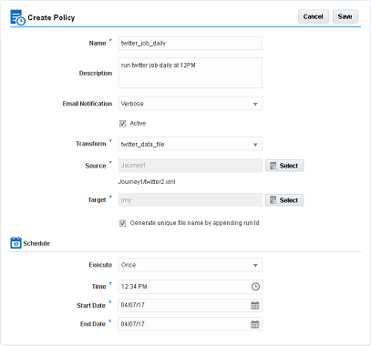 

After all information is given, click **Save** button to stored the policy into the job engine of the Preparation
Service. Later users can monitor job scheduling and execution from the Job tab.


